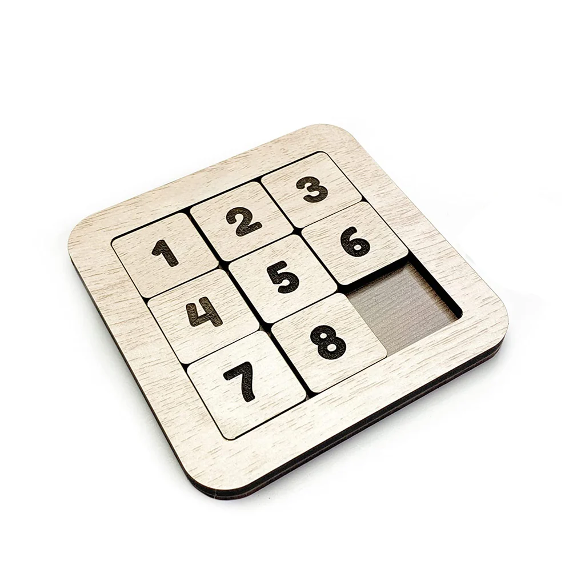

# SlidingPuzzleSolver

Sliding 3x3 Puzzle solver using graphs and Breadth-First Search(BFS). Finds the maximum number of steps to resolve any input game, total nodes, total edges, and total connected components.

<picture>
  <source srcset="images/NumberPuzzle6_1024x1024.webp" type="image/webp">
  
</picture>

## Why graphs?

Using graph theory to solve discrete problems in the computer science and computer engineering field is an extremely powerful tool. The depth of abstraction, and the relationships formed from it, allow us to reach conclusions only based on its structure and the way the graph was constructed.

In short, graphs are representations of relations between entities and their nature.  

## Creating the vertices

### What does this graph represents?

In this case, where're using a state graph to represent every possible movement at any time of an 3x3 slide puzzle. Every vertice contains the current state of the game, and every edge between vertices represents a "possible future" for the game, that is, a valid movement for the blank space. 

Using combinatorial analysis, we can easily calculate how many vertices we need to have in this graph (combination of 9 distinct numbers, 9! = 362880), the real challenge here is making a list with all 9! distinct combinations, and how to place every edges in a way that we only have valid movements in our game.

### Combination Recursive algorithm

In a counterintuitive way, this is a recursion that doesn't have a base case. The logical reason for this is that since we need n! combinations, and recursions trees usually have log(n) or n of height due to the input getting smaller and smaller, we need at least n! iterations (1 iteration per combination). In our case, our input will only get bigger and bigger.

To do this, first we need to choose a number by choice, and then append it. When we choose the second number, we have 2 possible choices: put this number before or after the first one on the list. Since we are calculating every single possibility of combination, we now have to call recursively the function itself inserting the new number in every possible position. The stop condition of this function is a constant number passed by parameter.

This algorithm can also be interpreted as a tree, which the function returns only the value of the leaves. Another way to think about it is if you choose a path between the root and any leaf of the graph, this path is the a possible sequence of decisions that leads to one of 9! of the valid permutations.

## Creating the edges

### Validating Movements

Every edge represents a valid movement between states. Therefore, when we have the empty space positioned in the middle, we have 4 movement options: up, down, left, and right; Creating edges between that vertice and the other 4 possible states.

### Why 2 connected components?

Based on the structure of that state graph, by having more than one connected component, we can infer that there are unreachable states if the shuffle of the pieces is made by following the game's rules, but this still doesn't answer the question of why specifically 2 components, or why not 5 or 12.

<!-- # To do

- Adapt functions of the code that actually resolves the puzzle
>the code at it's current state already have the capacity to do that, only needs adaptation. -->
